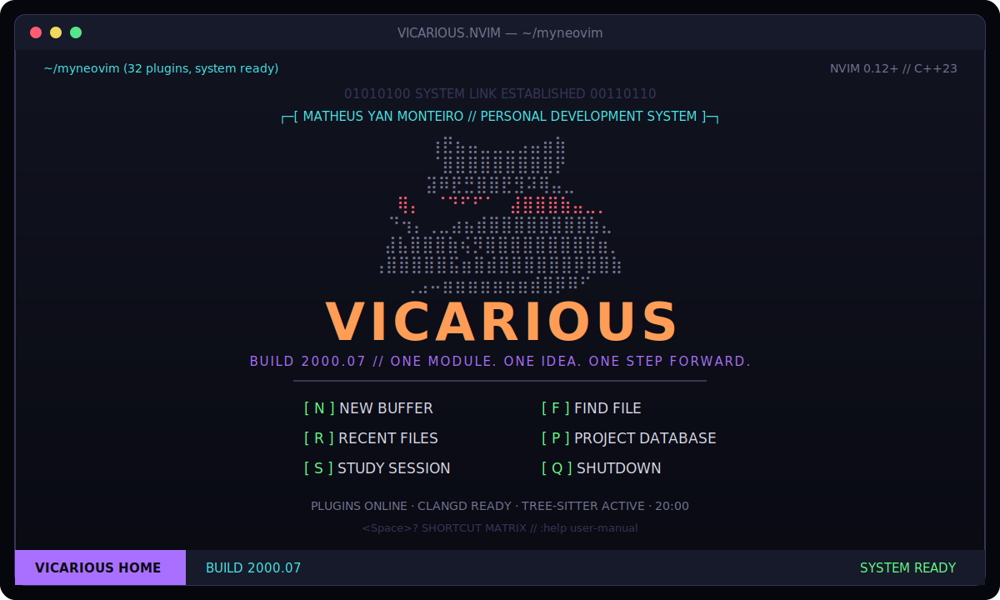

<div align="center">

# VICARIOUS.NVIM

### Matheus Yan Monteiro's Personal Development System

<p>
  
  
  
  
  
</p>

<p><em>Build knowledge. Ship systems.</em></p>



</div>

VICARIOUS.NVIM is a handcrafted Neovim configuration with a retro terminal,
CRT and cyberpunk identity. It was built one feature at a time to remain
readable, teachable and recoverable — no LazyVim, NvChad or AstroNvim layer in
between you and Neovim.

## Highlights

| Area | What is included |
| --- | --- |
| Interface | Custom VICARIOUS colorscheme, responsive dashboard, statusline, winbar and notifications |
| Navigation | Telescope, Neo-tree, bufferline and a persistent native terminal |
| Syntax | Treesitter highlighting, indentation and context |
| Intelligence | Mason, native LSP configuration, clangd, diagnostics and code actions |
| Completion | nvim-cmp, LuaSnip, friendly snippets and autopairs |
| AI workbench | OpenAI Codex and Anthropic Claude CLIs, contextual prompts and file watching |
| Markdown | Obsidian-style headings, callouts, tables, tasks, links and side preview |
| Git | Gitsigns, Diffview, hunks, history and blame |
| C++ | C++23 compiler workflow, Quickfix, clangd and codelldb |
| Debugging | nvim-dap, DAP UI, breakpoints, scopes, stack and REPL |
| Workflow | Sessions, Study Mode timer, comments, surround, Flash and Which-key |

## Fresh-machine installation

The bootstrap supports Linux and macOS. Install Git, clone the repository into
Neovim's standard configuration directory and run the installer:

```bash
git clone https://github.com/matheusyanmonteiro/myneovim.git ~/.config/nvim
cd ~/.config/nvim
./scripts/bootstrap.sh
```

The script detects apt, dnf, pacman, zypper or Homebrew and then:

1. Installs command-line prerequisites and a C/C++ toolchain.
2. Installs Neovim 0.12+ and tree-sitter CLI 0.26.1+ when required.
3. Restores plugins from `lazy-lock.json`.
4. Builds all configured Treesitter parsers.
5. Restores `clangd` and `codelldb` through Mason.

If dependencies are already present:

```bash
./scripts/bootstrap.sh --no-packages
```

Make sure the user-local binaries are visible to your shell:

```bash
export PATH="$HOME/.local/bin:$PATH"
```

Then launch the system:

```bash
nvim
```

To restore the optional AI workbench, install the official CLIs and complete
their interactive sign-in once:

```bash
curl -fsSL https://chatgpt.com/codex/install.sh | sh
curl -fsSL https://claude.ai/install.sh | bash
codex
claude
```

> A Nerd Font is strongly recommended. The dashboard text works everywhere,
> while file icons and interface symbols look best with JetBrainsMono Nerd Font.

## Requirements

- Neovim 0.12 or newer.
- Git, curl, tar and gzip.
- tree-sitter CLI 0.26.1 or newer.
- A C compiler for Treesitter parsers.
- ripgrep and fd for fast project search.
- g++ for the included C++ workflow.
- OpenAI Codex CLI and Anthropic Claude Code for the AI workbench.
- lsof and ps are recommended for detecting active agent processes.

The bootstrap handles the editor and system dependencies on supported systems.
See
[Fresh-system recovery](docs/RECOVERY.md) for the full recovery procedure and
manual verification steps. The AI bridge is restored with the other plugins;
the agent executables and authentication stay private and must be restored
separately.

## First minutes

`<leader>` is the Space key.

| Key | Action |
| --- | --- |
| `<leader>ud` | Open the VICARIOUS dashboard |
| `<leader>?` | Show the local shortcut matrix |
| `<leader>e` | Toggle the file explorer |
| `<leader>ff` | Find files |
| `<leader>fg` | Search text in the project |
| `<leader>tt` | Toggle the persistent terminal |
| `<leader>ac` | Open the Codex workbench |
| `<leader>aC` | Open the Claude workbench |
| `<leader>ap` | Choose a contextual AI prompt |
| `<leader>us` | Start or stop Study Mode |
| `<leader>mr` | Toggle rendered Markdown |
| `<leader>mp` | Open Markdown side preview |
| `<leader>cc` | Compile the current C++ file |
| `<F5>` | Start or continue debugging |

Read the complete [keymap reference](docs/KEYMAPS.md) or press `<leader>?`
inside Neovim.

## Project structure

```text
.
├── init.lua                    startup entry point
├── colors/vicarious.lua       custom colorscheme entry point
├── lua/
│   ├── config/                native options, mappings, terminal and LSP
│   ├── plugins/               one plugin specification per feature area
│   └── vicarious/             theme, dashboard, bars and Study Mode
├── after/ftplugin/cpp.lua     C++23 local workflow
├── lazy-lock.json             reproducible plugin revisions
├── scripts/                   bootstrap and system verification
├── docs/                      architecture, recovery and learning material
└── assets/                    repository preview
```

The [architecture document](docs/ARCHITECTURE.md) explains the startup sequence,
module boundaries and which files are intentionally kept out of Git.

## Learning resources

- [Complete Portuguese study guide](docs/guide-pt-BR.md)
- [Codex and Claude AI workbench guide](docs/AI_WORKBENCH.md)
- [Keymap reference](docs/KEYMAPS.md)
- [Architecture](docs/ARCHITECTURE.md)
- [Fresh-system recovery](docs/RECOVERY.md)

## Maintenance

Inside Neovim:

```vim
:Lazy
:Mason
:TSUpdate
:checkhealth
```

From the shell:

```bash
./scripts/check.sh
```

Always review plugin updates before committing the resulting
`lazy-lock.json`. The lockfile is part of the backup and should remain tracked.

## Design language

The built-in palette is deliberately small:

```text
background  #090A12    purple  #A970FF    cyan    #45E6E6
surface     #171A2A    magenta #FF5FBD    green   #55E68A
foreground  #D8D9E8    blue    #4D9EFF    orange  #FF9D57
muted       #72758F    red     #FF5C72    yellow  #F2D85C
```

Edit `lua/vicarious/theme/palette.lua` to change the identity. Every custom
highlight is defined explicitly in `lua/vicarious/theme/highlights.lua`.

## Philosophy

- Prefer native Neovim APIs when they teach the underlying concept clearly.
- Give every plugin one responsibility.
- Keep behavior explicit and modules small enough to study.
- Store configuration in Git; regenerate caches, tools and plugins.
- Build an editor that supports both software development and deliberate study.

## License

VICARIOUS.NVIM is released under the [MIT License](LICENSE). Third-party plugins
are downloaded from their own repositories and remain subject to their
respective licenses.

<div align="center">
  <sub>Designed and maintained by Matheus Yan Monteiro · BUILD 2000.07</sub>
</div>
